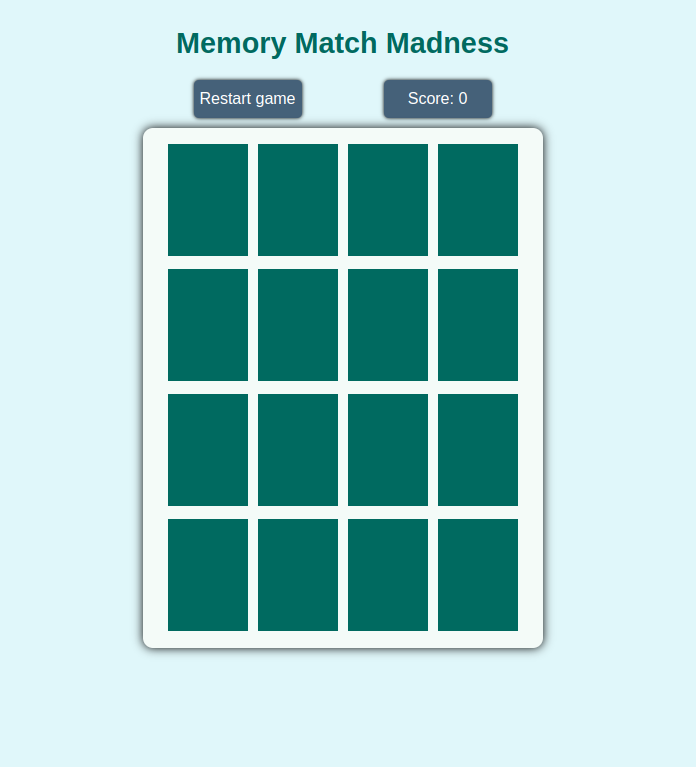

# Memory Match Madness

Memory Match Madness is an engaging and fun memory matching game where players flip cards to find matching pairs. Players earn points based on how quickly they match pairs, with fewer attempts yielding higher scores. The game is designed to be challenging and enjoyable for players of all ages.

## Table of Contents

- [Features](#features)
- [Screenshots](#screenshots)
- [Play the Game](#play-the-game)
- [Usage](#usage)
- [Game Rules](#game-rules)
- [Technologies Used](#technologies-used)
- [Contributing](#contributing)
- [License](#license)
- [Acknowledgements](#acknowledgements)

## Features

- Interactive card flipping with smooth animations
- Score tracking based on the number of attempts
- Congratulatory message displayed upon completing the game
- Reset button to restart the game
- Responsive design for various screen sizes

## Screenshots

## Play the Game

You can play Memory Match Madness directly in your browser by visiting the following link:

[Play Memory Match Madness](https://samelijah85.github.io/memory-match-madness/game/)

## Usage

1. Open the game in your web browser by visiting the link above.
2. Click on any card to flip it and reveal the image.
3. Try to find the matching card by flipping another card.
4. If the cards match, they will disappear; if not, they will flip back after a short delay.
5. Continue matching pairs until all cards are matched.
6. Your score will be displayed once you complete the game.

## Game Rules

- The game starts with all cards face down.
- Click a card to flip it and reveal the image.
- Match pairs of cards with the same image.
- Points are awarded based on the number of attempts:
  - First attempt: Full score (8 points)
  - Second attempt: Half the score (4 points)
  - Third attempt: Half the previous score (2 points)
  - Subsequent attempts: Points continue to halve until zero
- The game ends when all pairs are matched, and a congratulatory message with the final score is displayed.

## Technologies Used

- HTML
- CSS
- JavaScript

## Contributing

Contributions are welcome! If you'd like to contribute to this project, please follow these steps:

1. Fork the repository.
2. Create a new branch (`git checkout -b feature/YourFeature`).
3. Make your changes and commit them (`git commit -m 'Add some feature'`).
4. Push to the branch (`git push origin feature/YourFeature`).
5. Open a pull request.

## License

This project is licensed under the MIT License - see the [LICENSE](LICENSE) file for details.

## Acknowledgements

- [Material Design](https://m3.material.io/styles/color/system/overview) for color inspiration.
- Everyone who has contributed to the project by playing and providing feedback.
